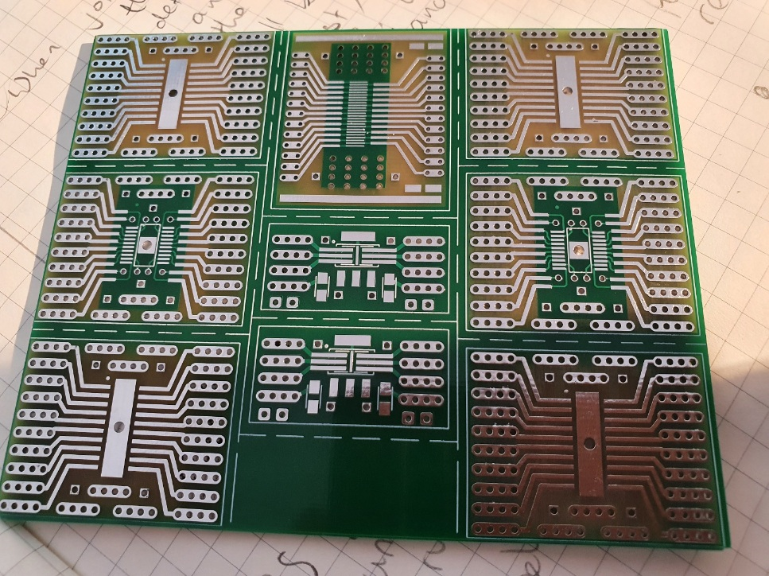
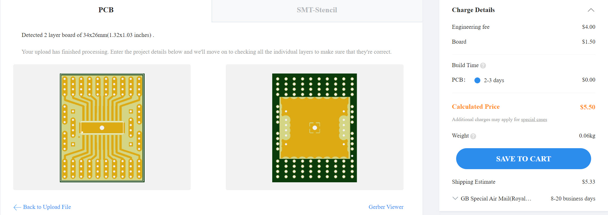
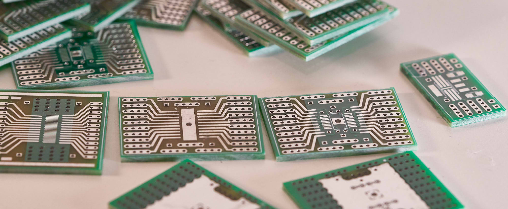
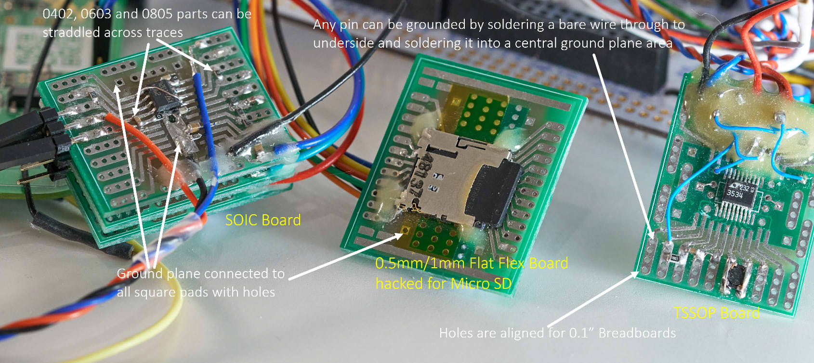
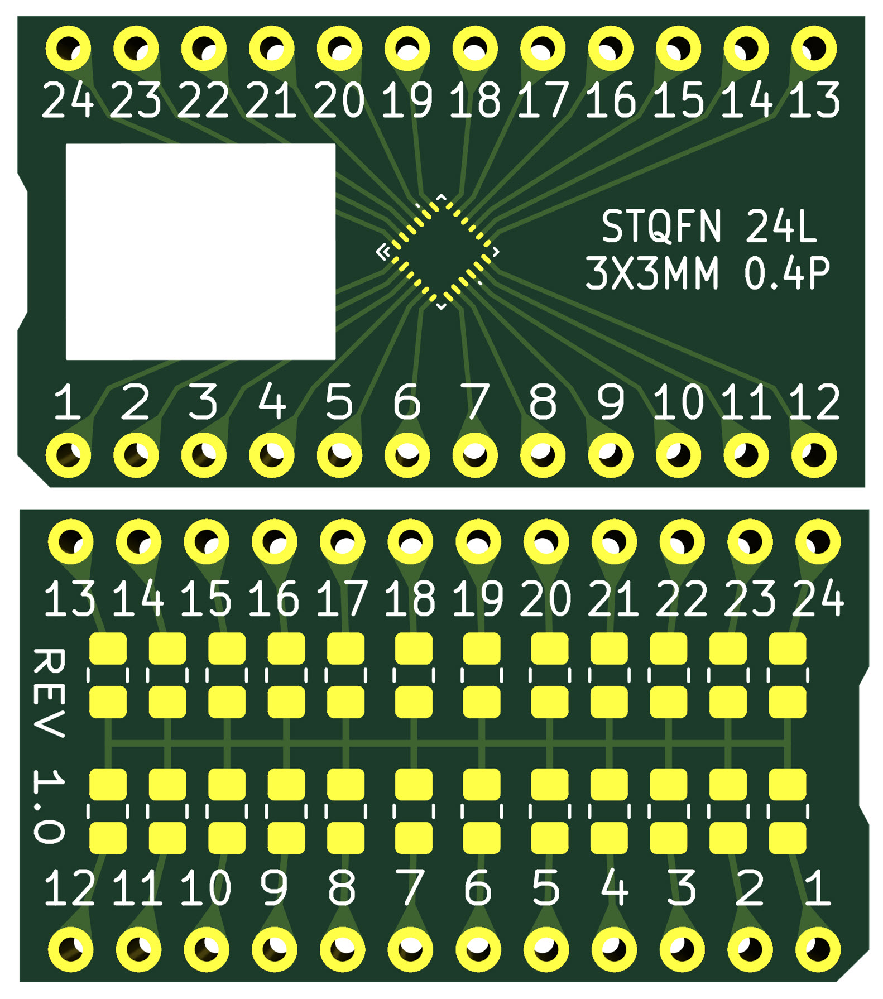
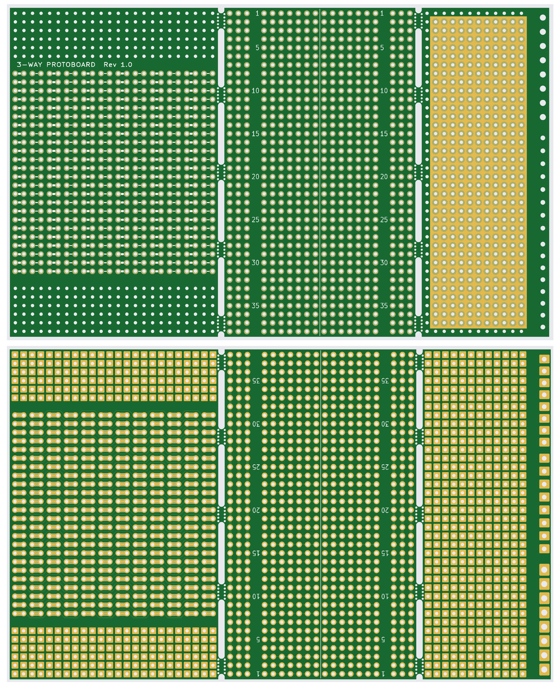

# smd-proto-board

License: The files in this repository are for non-commercial use only. They are free to use for educational use and home use, but are not licensed for sale or for any business or commercial use.

This repository contains PCB files (also known as Gerber files) for surface mount device (SMD) breakout boards. There are individual sets of files for the following SMD types:
SOIC
TSSOP
SOT23 / SOT23-5 / SOT23-6

There are two options:

(1) [Not recommended] A single board containing various SOIC/TSSOP/SOT23 packages. It is not recommended because there are no grooves/scored lines or mouse-bites; the individual adapter boards will need to be cut to be separated. Cutting will cause dust!

(2) [Recommended!] Individual Gerber files per SMD footprint. The cost is not much to get the individual boards made. 

To order, select the relevant zip file from this repository, and upload it to a PCB factory website (e.g. jlcpcb.com). The website will automatically detect the zip file content and handle it accordingly.

Here is an example upload using the export-soic-only.zip file. In this example, it can be seen that 20 boards can be manufactured for $5.50, which is very cost-effective:

This is what the boards look like:

The photo below shows example usage:

The export_qfn24_l_3_3_0_4mm_gerbers_rev1.zip file contains a layout intended for a specific QFN chip, it is not a standard part. It is suitable for Renesas SLG47004 (GreenPAK) and SLG47910 (FPGA) devices.

Note: There's also a non-SMD prototyping board, which might be handy. It is the file called export-gerbers-three-way-protoboard-rev1.zip

The render below shows what it looks like. Try it, you might like it!

